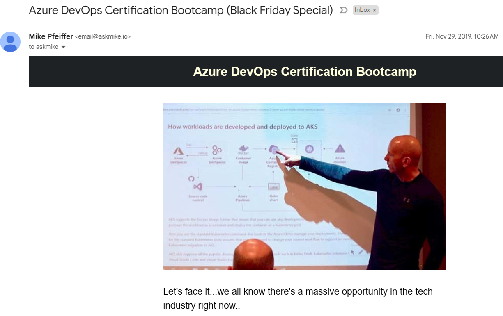
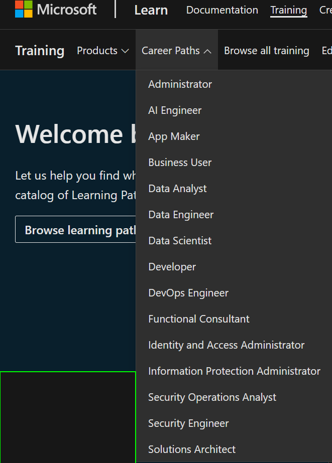
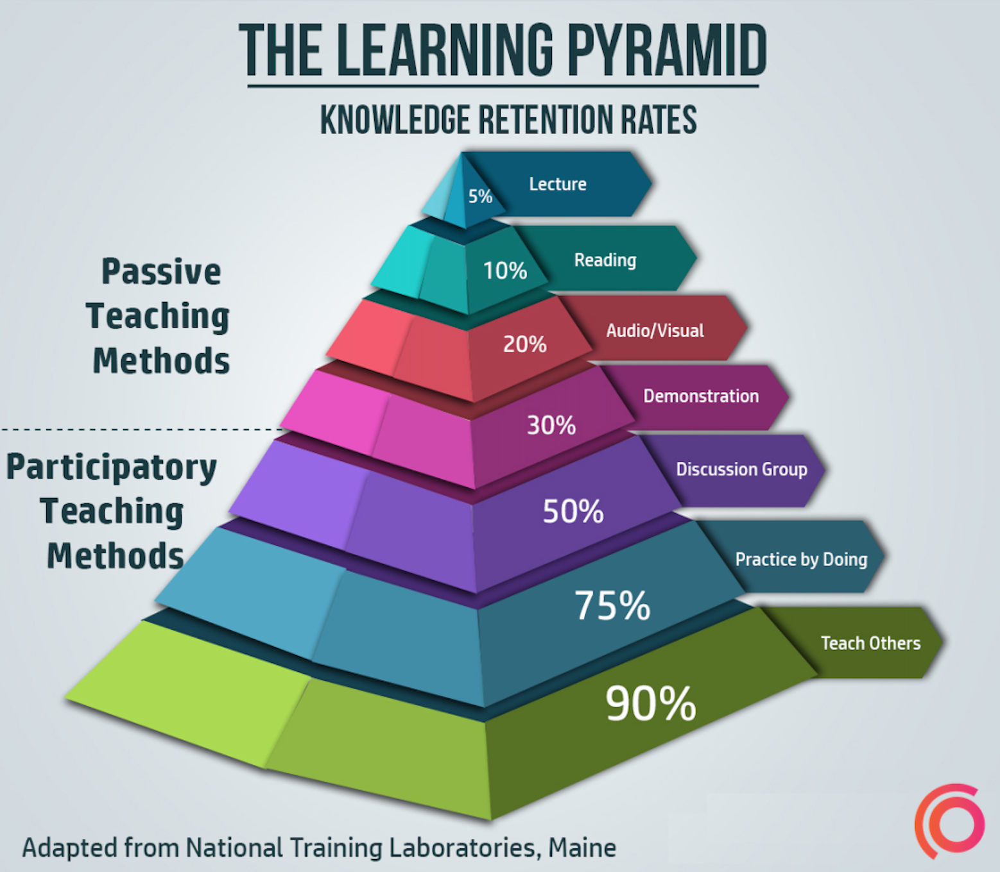

# Teach to Learn Azure in 2024

## David Cobb, Azure MCT

---

# Intro

<button onclick="document.querySelectorAll('section').forEach((e) => e.classList.toggle('invert'))">Toggle appearance</button>

---

# Goals for Talk
- Share actionable tips for achieving certifications
- Explain my definition of an Azure 'Cloud Expert'
- Convince you to learn by teaching (start small)
- Help you get started by plugging into community

---

# Why listen to me?

> *I've been at this a while...*

## Microsoft Learn Transcript:
https://learn.microsoft.com/en-us/users/dpc/transcript/vprpnfx5gxr2z8r

##

---

## Some MTM student feedback 😄
- I loved David's enthusiasm - he's super knowledgeable about Azure and it shows.

- David was a terrific instructor. The best parts of the course were unscripted parts where we discussed specific real world examples or topics tangentially related to the course (providing greater context to the material).

- I asked as much as I wanted and got to work on custom labs with the instructor side by side.

- The instructor is very knowledgeable, very personable, and has an infectious love for teaching this content. I plan to take several more of these classes, I hope he is teaching them.

*(Yup, I'm bragging here. Come at me.)*

---

# Azure classes I've taught the most:

- AZ-400 DevOps (16 times), AZ-204 Developer (11x), AZ-104 Administrator (8x), DP-203(7x) Data Engineer, DP-300 Database Administrator (11x), AZ-500(3x)
---

# What this presentation is and is not

- IS
  - Brief summary of my **general certification approach** as an Azure MCT
  - What **worked for me**, will not for everyone
  - Typically teach enough to **help folks in their first week** of learning a new Azure topic 
  - Way to get from **noob to beginner **or intermediate knowledge
  - *Exploring how to apply what I learned to learning in community*
- IS NOT
  - Approach to get deep expert knowledge (ask an MVP)
  - How to build Azure solutions (that's down the road)

---

# My Story

- Short Version
  - MCDBA Bootcamp
- Longer Version in [talk to GLUG on YouTube](https://www.youtube.com/watch?v=XPNxYoARcDE&t=2s)

---

# Key Ideas That Carried Me There to Here
- Survival
- Commitment
- Learning from Mistakes
- Community
---

# Survival
- Desire to provide for family without returning to a boring job
- Midlife career crisis forced me to start my own career
- All distractions fell away as I focused on survival

---

# Commitment
- Committing to teach a course provides motivation
- Focus factor comes from a deadline and keeping my word
- This makes saying no to distractions & discouragement easier

---

# Learn from Mistakes
- Fail once and give up was no longer an option
- Learning, communicating and correcting the mistake fast is key for applications, and for people...
- The closest we get to perfection is correcting course quickly
- This approach makes the impossible possible, eventually

---

# Community

- Nov 2019, I found Mike Pfieffer's CloudSkills community
- The content & community helped me believe I could learn to be an Azure DevOps pro 😁

---

# *Fast Forward...*
---

# How I Prepare to Teach an Azure class

- Leverage Learn.Microsoft.com
- Choose next topic (interest, aptitude, demand)
- Take Tim Warner's 3 Legged Stool Approach

---

# Tim Warners's 3 Legged Stool of Cert Prep
- Concepts & Theory
- Hands-On Learning
- Test Preparation

---

# Hands-On Labs *(I Start Here)*
- [MicrosoftLearning Git Repo](https://github.com/MicrosoftLearning/) (free and public, MIT licensed)
- Lab provider (ex. Skilable, XTremeLabs,GoDeploy) (cost $, [MCT lab access](https://aka.ms/mctlabprep))
- Following curiosity thru MS Learn quickstarts & walkthroughs
- ***Collecting links, notes, workarounds & questions as I use the portal & cloud shell is how I make a 'first pass' through the content.***
---

# Concepts & Theory

- Review Exam Page
- Review Study Guide
- Study When I Can (Phone!)
- Role -> Learning Paths -> Modules -> Units
- [YouTube like John Savill](https://www.youtube.com/@NTFAQGuy) for background learning during non-focused times. 

---

# Test Prep
- The point of test prep is to spotlight your knowledge gaps
- You only LEARN when you get a question WRONG and understand why
- MS Practice Assessment (free)
- Measure Up ($$$ but saves time)
- WhizLabs ($ more Qs, lower quality)
- AVOID DUMPS! 
    - Invalidates your cert
    - Only cheats yourself

---

# Tips to Deliver Training
- Teach by REFERENCE instead of REMEMBERANCE
    - Research the question to verify your answer & share that link
    - Updates your skills real time, mastering the docs
    - Teach to fish
- Baby steps to grow your confidence
    - Always choose the next step that gives you the RIGHT amount of challenge.
    - Teach ONE person
    - Teach a group
    - (Maybe) make content that teaches many

---

# Your Next Steps

---

# Choose Your Own Adventure 
## *or two, or three*

---

# What's your North Star?

- Envision a destination *( for your Azure career )*
- It will change over time, you only need it to have a direction to build momentum
- Then answer this question daily, adjusting as needed:

---

# To move toward my North Star of ___________, I'll pursue the certification for the role of _________, and my next step today is to study __[module|labs|test questions]__

---

# 3 Stages of Learning
- Learning from in **institution** is the **first** phase of learning
- Learning **solo self directed** is the **second** phase of learning.
- Learning **alongside others** is the **third** phase of learning. Requires culture of supporting others.
  
---

### As an Azure teacher, being accountable to my customer, client & student keeps me focused.

### What can you commit to as a learner to get this same focus?

### Study Group!

<!-- Talk about Cecilia's study group rules. -->
---

Microsoft Learn Community
https://learn.microsoft.com/en-us/training/learn-community

PROTIP: Dive into the learning rooms

https://techcommunity.microsoft.com/t5/custom/page/page-id/learn

---

> To teach is to learn twice.

> \- Joseph Joubert

---

# Choose the right challenge level for you right now
- https://twitter.com/dave000777/status/1715546218930069928

---

# Take Action
- Step out from learning solo & learn in a group
- Consider [pursuing your MCT certification](https://learn.microsoft.com/en-us/credentials/certifications/mct-certification)
- Create your future by learning interesting stuff and helping others learn it as well.

---

# Next Steps for Me in 2024
- Azure focus on AI
- Workshops
- Building in public
- Finding my way from academic to practical & applied Azure know-how 
  
---

# Calls to Action 

- Come to a AI workshop 
- Join a study group (like DP-600)
- Join the MS Learning Rooms
- Plug into the community
  
---

# Questions?

- Reach out to me for FREE AZURE CERTIFICATION MENTORING  (money back guarantee!)
- https://linkedin.com/in/davidcobb

---

# Credits

Shoutout to the amazing Chris Ayers for his MARP template that made this markdown-to-html presentation simple to deploy.

https://chris-ayers.com/2023/03/26/marp-create-presentations-with-markdown

Learned so much about teaching Azure from Tim Warner, check out his YouTube channel
[Tim's IT Straight Talk: "A Recipe to Pass any IT Certification Exam"](https://www.youtube.com/watch?v=wpPZY_KrRLo)

---

> Extra stuff, nothing to see here, move along

---

# Virtuous cycle
- Find next Azure certification topic based on **interest, aptitude & demand.**
- **Deep dive, all in learning** for a few weeks, and** share that knowledge **with a class, **researching questions **I can't answer.
- Choose the next most interesting topic.
- Azure cloud topics overlap, each success makes the next easier.
- The satisfaction of assisting others toward their career goals fuels me.

<!-- build evidence of competence by obtaining certifications, teaching, helping others, and solving problems. -->

---
# My Presentation

---

<!-- Speaker Notes -->
## Slide 1

- Item 1
- Item 2
- Item 3
<!-- Can have multiple on a slide -->

---

## Slide 2
<!-- Can also do a multiline
comment that will show in notes -->

---

## Slide 3

> This is a quote.

---

## Slide 4

| Column 1 | Column 2 |
| -------- | -------- |
| Item 1   | Item 2   |
| Item 3   | Item 4   |

---

## Slide 5

## Left

- 1
- 2

## Right

- 3
- 4

---

## Slide 6

<i class="fa-brands fa-twitter"></i> Twitter: 
<i class="fa-brands fa-mastodon"></i> Mastodon: 
<i class="fa-brands fa-linkedin"></i> LinkedIn: 
<i class="fa fa-window-maximize"></i> Blog: 
<i class="fa-brands fa-github"></i> GitHub: 

---

# <!--fit--> Large Text

---

<!-- Needed for mermaid, can be anywhere in file except frontmatter -->

# Mermaid

graph TD;
    A-->B;
    A-->C;
    B-->D;
    C-->D;

---
